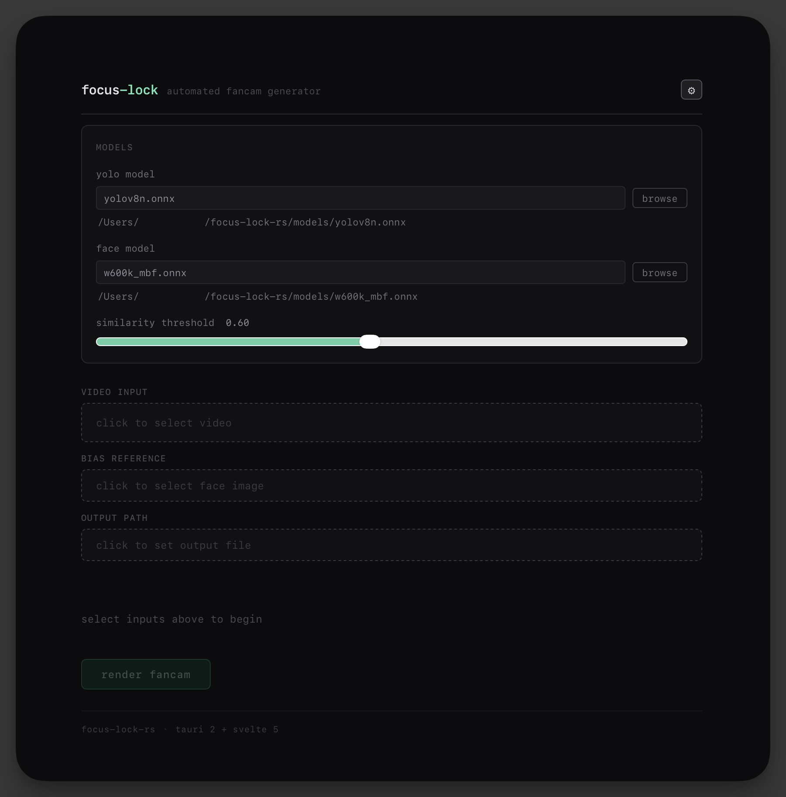
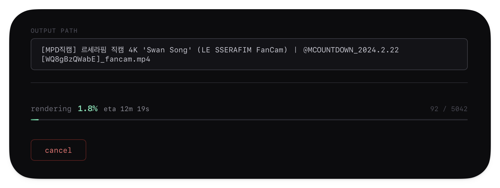
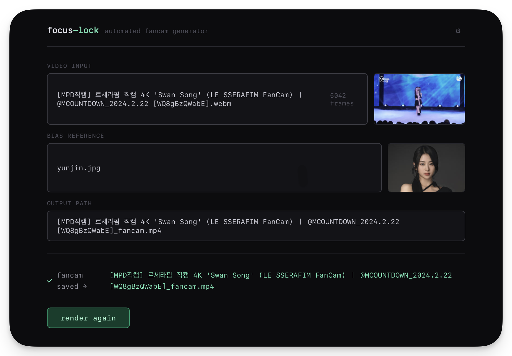

# focus-lock-rs


Automated fancam generator. It takes a standard landscape video and a reference photo of a person (say, your bias), tracks them, and generates a stabilized, vertical (9:16) cropped video locked onto them.

It features a modular Rust core for video processing, a CLI for batch operations, and a modern Tauri v2 desktop application for easy usage.

<p align=center>

</p>

## Features

- **Person detection + identity lock** — YOLOv8 for detection, ArcFace for target matching
- **Offline two-pass render path** — first pass builds tracklets, second pass clusters identity/camera observations before final encode
- **Smooth tracking** — online Kalman path retained for compatibility and fallback workflows
- **Identity discovery (GUI)** — candidate scan and manual validation before render
- **Performance-first pipeline** — threaded video pipeline with optimized preprocessing and rendering
- **Smart output** — automatic 1080x1920 crop with fallback handling for occlusion or target loss
- **Desktop + CLI** — Tauri app for interactive use, CLI for direct batch processing
- **Safe cancellation** — renders write beside the requested output and replace it only after a complete encode
- **Durable job queue** — SQLite-backed queue with retries, restart recovery, deduplication, and dead-letter replay

##  Architecture

This project is organized as a Cargo workspace:

- **`fancam-core/`** — Rust engine for detection, identity matching, tracking, and rendering
- **`cli/`** — command-line interface for batch and scripted workflows
- **`src-tauri/` + `ui/`** — Tauri desktop app with a Svelte frontend

##  Logic Flow

### Offline two-pass (default render path)

1. **Decode pass** source frames with FFmpeg
2. **Detect + score** identities and build short-term tracklets
3. **Cluster tracklets heuristically** to stabilize identity assignment
4. **Plan camera path** from the selected clustered identity observations
5. **Render pass** writes stabilized vertical H.264 output

### Online fallback (legacy-compatible path)

1. **Decode** video frames with FFmpeg
2. **Detect** people with YOLOv8
3. **Match** the target identity with ArcFace
4. **Track** motion across frames with Kalman smoothing
5. **Render** a stabilized vertical crop to H.264

<p align=center>


</p>

## Prerequisites

- **macOS** with CoreML support
- **Rust 1.88+**
- **Node.js 22** for the desktop UI
- **FFmpeg 8.1** native libraries and `pkg-config`
- ONNX models for **YOLOv8 Nano** and **ArcFace / MobileFaceNet**

With Homebrew, install the native dependencies with `brew install ffmpeg pkg-config`.

## Setup

```bash
git clone https://github.com/wheevu/focus-lock-rs.git
cd focus-lock-rs
cargo build --release -p cli
```
Create a `models/` directory in the project root and add:
- `yolov8n.onnx`
- `w600k_mbf.onnx`
- `osnet_x0_25_msmt17.onnx` *(optional but recommended for harder multi-person tracking / occlusion recovery)*

Runtime note: the current ONNX Runtime setup requires a CoreML-capable `libonnxruntime.dylib`, so the supported development target is macOS. Place it at `models/onnxruntime/lib/` or set `ORT_DYLIB_PATH`.

The optional OSNet body re-identification model improves recovery in crowded footage.
Face identity scoring works without it.
The GUI accepts an explicit model path, while the current CLI does not expose a `--body-reid-model` flag; a missing default model is allowed.

## Desktop Application (GUI)

```bash
cd ui
npm ci
npm run tauri:dev
```
For a production build:
```bash
npm run tauri:build
```

##  CLI
Generate a fancam from a landscape video and reference image:

```bash
cargo run --release -p cli -- fancam \
  --video "/path/to/concert.mp4" \
  --bias "/path/to/face_photo.jpg" \
  --output "output_fancam.mp4" \
  --yolo-model "models/yolov8n.onnx" \
  --face-model "models/w600k_mbf.onnx" \
  --threshold 0.6
```

Note: render runs a mandatory offline prepass (tracklet build + clustering)
before final encode, so startup may be slower on long videos.

The desktop app stores scan sessions, exported diagnostics, and durable queue state in Tauri's platform app-data directory. On first launch it copies valid data from the old project-local `.focus-lock/` directory and leaves the originals untouched. Queue messages recover after an app restart; failed messages can be retried or replayed from the dead-letter queue.

## Development checks

```bash
cargo fmt --all -- --check
cargo clippy --workspace --all-targets --all-features --locked -- -D warnings
cargo check --workspace --locked
cargo test --workspace --locked
cargo run -p fancam-core --example solver_eval --locked
(cd ui && npm run check && npm test && npm run build)
```

## License
MIT

<details>
<summary><strong>Tracking, performance, and GUI details</strong></summary>

## Tracking and identity locking

The pipeline combines **person detection** and **face recognition** to keep the crop locked onto a specific subject rather than just the most visible person in frame.

- **YOLOv8-Nano** detects person bounding boxes efficiently through ONNX Runtime
- **ArcFace** compares cropped face embeddings against the provided reference image using cosine similarity
- the configured `--threshold` value is used consistently across both CLI and GUI workflows
- tracking includes **relock bias** from the last known position to improve recovery after brief occlusion
- identity checks are throttled adaptively once lock-on is established to reduce unnecessary compute

This makes the tracker more stable in crowded performance footage where multiple people may appear and disappear across frames.

## Identity discovery pass (GUI)

The desktop app includes a pre-tracking discovery flow designed to make target selection more reliable before rendering begins.

- sampled frames are scanned first to propose likely identity candidates
- the UI can accept an **expected member count** and trigger a smarter rescan if duplicates or count mismatches are detected
- users can manually review candidates before rendering:
  - exclude false positives
  - resolve duplicates
  - confirm low-confidence matches
- once validated, the selected member card is used as an additional tracking prior alongside the reference image

The Tauri backend persists scan sessions and validates review state server-side before allowing a render to begin.

Cancellation returns a tracking session to `validated`, records a `tracking_cancelled` event, and leaves any previous output file unchanged. A failed render also removes its temporary partial file.

## Scan session lifecycle

To make the review and render flow more robust, scan sessions track explicit lifecycle states:

- `proposed`
- `validated`
- `tracking`
- `completed`
- `failed`

Audit events are recorded through the session lifecycle, and `run_fancam` enforces that a validated session and selected identity match exist on the backend side, not just in the UI.

The GUI also supports **manual split requests per identity**, with a split-rescan path that refreshes candidate clustering when the initial grouping is not clean enough.

## Smoothing and motion stability

To avoid shaky or jumpy crops, the render path uses a **2D Kalman filter** to smooth subject motion across frames.

This helps with:
- reducing abrupt camera jumps
- keeping the framing more natural
- preserving momentum when the target is briefly lost
- simulating the feel of a human camera operator rather than a raw detector box snap

If the subject becomes occluded, the filter predicts the next likely position based on previous motion until visual confirmation is regained.

## Performance pipeline

The online processing path uses bounded synchronous channels across three worker stages (decode, analysis, render) plus main-thread encode.

The offline render path adds a first pre-render pass to build tracklets and a clustered camera plan before the final encode pass.

Performance-oriented behavior includes:

- recognition throttling before and after lock-on to reduce CPU stalls
- capping ArcFace checks to top-confidence person candidates per frame
- detection downscale for faster large-video processing
- parallel tensor preparation where possible
- SIMD face preprocessing where available
- render buffer and resizer reuse to reduce per-frame allocations
- periodic per-stage timing logs for `detect`, `identify`, and `render`

These optimizations are aimed at keeping the pipeline responsive and practical for longer videos. No reproducible benchmark results are published yet.

For a deterministic solver/camera smoke benchmark that does not require models or media, see `bench/README.md`.

## Rendering behavior

Rendering is optimized for vertical fancam output while remaining resilient when tracking quality changes.

- automatic **1080x1920** framing for vertical output
- SIMD-accelerated resize path with `fast_image_resize`
- **Lanczos3** upscaling when the subject is distant in frame
- fallback **letterboxing** when the target is lost or visibility drops too far

This keeps output usable even when the tracker cannot confidently maintain a tight crop for every frame.

## Crop-plan sidecars

`--plan-output` writes a versioned `focus-lock.crop-plan` JSON sidecar. Frame
indices are one-based throughout the decoder, Rust plan, and Svelte editor:
valid source frames are `1..=frame_count`. Crop centers are stored after the
same frame-boundary normalization used by the renderer, so an imported plan
does not silently render a different crop at an edge. The frame count is the
actual number decoded by the offline prepass, not a container estimate, and V1
plans use the renderer's fixed 1080x1920 output.

Each plan includes a `sha256-sampled-container-v1` source fingerprint. It hashes
canonical metadata, file length, and at most sixteen evenly spaced 64 KiB raw
container windows (1 MiB maximum); it excludes paths, decoded pixels, and
embeddings. This bounded identity catches many source substitutions without
the cost of a full-file hash, but changes outside the sampled windows can go
undetected. `--plan-input` and the desktop importer reject a fingerprint
mismatch before applying manual corrections.

The desktop render flow creates a sidecar beside the output by default using
`<output-stem>.crop-plan.json`; the path can be changed before rendering.

## Interfaces

The project supports two main usage paths:

### Desktop app
The Tauri desktop application is intended for interactive use:
- scan identities visually
- validate candidates
- select a target
- run render jobs without touching the command line

### CLI
The CLI is better suited for:
- direct runs
- repeated experiments
- scripting and batch workflows
- debugging model thresholds and pipeline behavior

## Cross-platform scope

The project currently targets **macOS** because CoreML-enabled ONNX Runtime is required by the checked-in runtime configuration. Windows/Linux support would need a non-CoreML runtime path and CI coverage.

</details>
