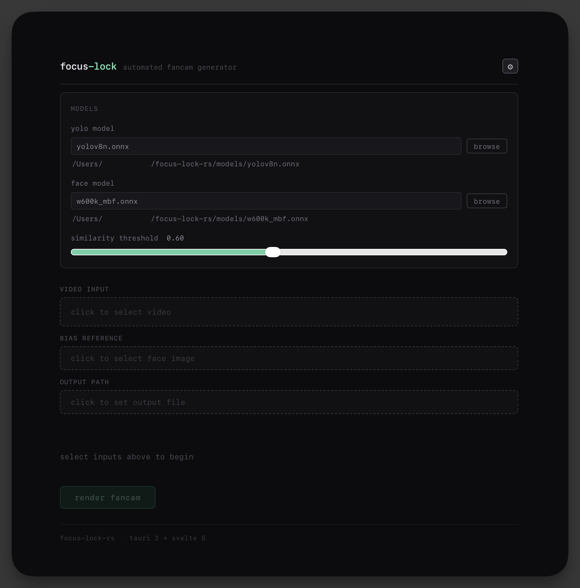

# focus-lock-rs


High-performance automated fancam generator. It takes a standard landscape video and a reference photo of a person (say, your bias), tracks them, and generates a stabilized, vertical (9:16) cropped video locked onto them. 

It features a modular Rust core for high-speed video processing, a CLI for batch operations, and a modern Tauri v2 desktop application for easy usage.



##  Features

*   **Person Detection**: Uses **YOLOv8-Nano** via ONNX Runtime for fast, accurate person detection.
*   **Identity Locking**: Uses **ArcFace** (cosine similarity) to distinguish the specific target person from others in the frame.
    *   Uses your configured `--threshold` value end-to-end (CLI + GUI).
    *   Adds relock bias from last known position and adaptive recognition stride for better stability under occlusion.
*   **Cinematic Smoothing**: Implements a **2D Kalman Filter** to smooth camera movements, preventing jittery tracking and simulating a professional camera operator.
*   **Performance-First Pipeline**:
    *   3-thread decode/inference/encode pipeline with bounded channels.
    *   Recognition throttling before and after lock-on to avoid CPU stalls (adaptive while locked).
    *   Caps ArcFace identity checks to top-confidence person candidates per frame.
    *   Speeds up large-video processing with detection downscale, parallel tensor prep, and fast SIMD face preprocessing.
*   **Smart Rendering**:
    *   Automated 1080x1920 cropping.
    *   SIMD-accelerated resize path (`fast_image_resize`) for crop and letterbox operations.
    *   Lanczos3 upscaling for distant subjects.
    *   Fallback letterboxing when the target is lost/occluded.
*   **Cross-Platform**: Runs on Windows, macOS, and Linux.

##  Architecture

The project is organized as a Cargo workspace:

*   **`fancam-core/`**: The engine. Handles FFmpeg transcoding, ONNX inference, Kalman tracking, and image processing.
*   **`cli/`**: A command-line interface wrapper for the core engine.
*   **`src-tauri/`** & **`ui/`**: The Desktop application built with Tauri 2 and Svelte 5.

##  Logic Flow

1.  **Decode**: FFmpeg decodes the video stream into RGB frames.
2.  **Detect**: YOLOv8 runs inference on the frame to find all "Person" bounding boxes.
3.  **Identify**: The system crops faces from top-confidence person boxes and compares their embeddings against the reference "bias" image using ArcFace.
4.  **Track**:
    *   If the target is found, the Kalman filter updates position and velocity.
    *   Recognition runs at a stride (before and after lock-on) to reduce CPU load.
    *   If occluded, the filter predicts the position based on previous momentum.
5.  **Render**: The frame is cropped to the smoothed coordinates and re-encoded to H.264.


##  Prerequisites

To build and run this project, you need:

1.  **Rust**: Stable toolchain ([Install](https://rustup.rs/)).
2.  **Node.js**: Required for the UI build steps.
3.  **FFmpeg Libraries**: The project links against FFmpeg native libraries.
    *   **Ubuntu/Debian**: `sudo apt install libavutil-dev libavformat-dev libavcodec-dev libswscale-dev`
    *   **macOS**: `brew install ffmpeg`
    *   **Windows**: Set `FFMPEG_DIR` environment variable to your FFmpeg shared build.

### ONNX Runtime provider note (macOS)

This project requests CoreML execution when available.

- Default lookup path is `models/onnxruntime/lib/libonnxruntime.dylib`.
- If CoreML is unavailable in your local ONNX Runtime build, inference falls back to CPU (works, but much slower on 4K inputs).
- For best Apple Silicon performance, use an official ONNX Runtime macOS build that includes CoreML support.

##  Installation & Setup

1.  **Clone the repository:**
    ```bash
    git clone https://github.com/your-username/focus-lock-rs.git
    cd focus-lock-rs
    ```

2.  **Download Models:**
    Create a `models/` directory in the root and download the following ONNX models:
    *   `yolov8n.onnx` (YOLOv8 Nano)
    *   `w600k_mbf.onnx` (MobileFaceNet / ArcFace)

3.  **Build the CLI:**
    ```bash
    cargo build --release -p cli
    ```

## Desktop Application (GUI)

The GUI allows you to select files via drag-and-drop and visualize progress.

1.  **Install frontend dependencies:**
    ```bash
    cd ui
    npm install
    ```

2.  **Run in Development Mode:**
    ```bash
    npm run tauri:dev
    ```

3.  **Build for Production:**
    ```bash
    npm run tauri:build
    ```
    The executable will be located in `src-tauri/target/release/bundle/`.

##  CLI Usage

The CLI provides direct access to the pipeline phases.

### Generate a Fancam
The primary command. It performs detection, identification, tracking, and rendering in one pass.

```bash
cargo run --release -p cli -- fancam \
  --video "/path/to/concert.mp4" \
  --bias "/path/to/face_photo.jpg" \
  --output "output_fancam.mp4" \
  --yolo-model "models/yolov8n.onnx" \
  --face-model "models/w600k_mbf.onnx" \
  --threshold 0.6
```

### Other Commands

*   **Smoke Test (Grayscale)**: Verifies FFmpeg linkage and basic video I/O.
    ```bash
    cargo run -p cli -- gray --input video.mp4 --output gray.mp4
    ```

*   **Debug Detection**: Draws bounding boxes around *all* detected people without cropping.
    ```bash
    cargo run -p cli -- detect --input video.mp4 --output boxes.mp4
    ```

## Contributing

Contributions are welcome! Install `rustfmt` and gimme your PRs.

```bash
cargo fmt
cargo test
```
