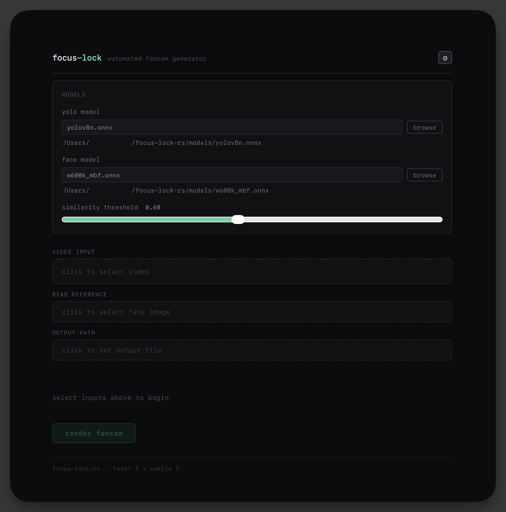
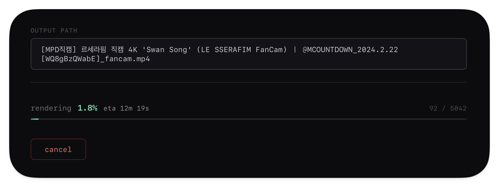
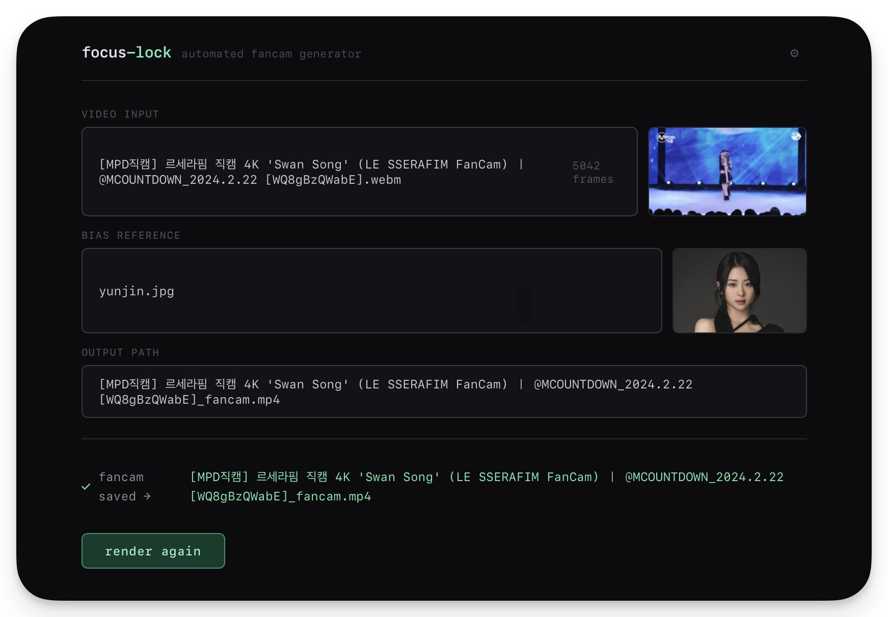

# focus-lock-rs


Automated fancam generator. It takes a standard landscape video and a reference photo of a person (say, your bias), tracks them, and generates a stabilized, vertical (9:16) cropped video locked onto them. 

It features a modular Rust core for high-speed video processing, a CLI for batch operations, and a modern Tauri v2 desktop application for easy usage.

<p align=center>

</p>

## Features

- **Person detection + identity lock** — YOLOv8 for detection, ArcFace for target matching
- **Smooth tracking** — Kalman-filtered motion for less jitter and more stable framing
- **Identity discovery (GUI)** — candidate scan and manual validation before render
- **Performance-first pipeline** — threaded video pipeline with optimized preprocessing and rendering
- **Smart output** — automatic 1080x1920 crop with fallback handling for occlusion or target loss
- **Desktop + CLI** — Tauri app for interactive use, CLI for direct batch processing

##  Architecture

This project is organized as a Cargo workspace:

- **`fancam-core/`** — Rust engine for detection, identity matching, tracking, and rendering
- **`cli/`** — command-line interface for batch and scripted workflows
- **`src-tauri/` + `ui/`** — Tauri desktop app with a Svelte frontend

##  Logic Flow

1. **Decode** video frames with FFmpeg
2. **Detect** people with YOLOv8
3. **Match** the target identity with ArcFace
4. **Track** motion across frames with Kalman smoothing
5. **Render** a stabilized vertical crop to H.264

<p align=center>


</p>

## Prerequisites

- **Rust** stable toolchain
- **Node.js** for the desktop UI
- **FFmpeg** native libraries installed on your system
- ONNX models for **YOLOv8 Nano** and **ArcFace / MobileFaceNet**

## Setup

```bash
git clone https://github.com/your-username/focus-lock-rs.git
cd focus-lock-rs
cargo build --release -p cli
```
Create a `models/` directory in the project root and add:
- `yolov8n.onnx`
- `w600k_mbf.onnx`

## Desktop Application (GUI)

```bash
cd ui
npm install
npm run tauri:dev
```
For a production build:
```bash
npm run tauri:build
```

##  CLI
Generate a fancam from a landscape video and reference image:

```bash
cargo run --release -p cli -- fancam \
  --video "/path/to/concert.mp4" \
  --bias "/path/to/face_photo.jpg" \
  --output "output_fancam.mp4" \
  --yolo-model "models/yolov8n.onnx" \
  --face-model "models/w600k_mbf.onnx" \
  --threshold 0.6
```

## License
MIT

<details>
<summary><strong>Tracking, performance, and GUI details</strong></summary>

## Tracking and identity locking

The pipeline combines **person detection** and **face recognition** to keep the crop locked onto a specific subject rather than just the most visible person in frame.

- **YOLOv8-Nano** detects person bounding boxes efficiently through ONNX Runtime
- **ArcFace** compares cropped face embeddings against the provided reference image using cosine similarity
- the configured `--threshold` value is used consistently across both CLI and GUI workflows
- tracking includes **relock bias** from the last known position to improve recovery after brief occlusion
- identity checks are throttled adaptively once lock-on is established to reduce unnecessary compute

This makes the tracker more stable in crowded performance footage where multiple people may appear and disappear across frames.

## Identity discovery pass (GUI)

The desktop app includes a pre-tracking discovery flow designed to make target selection more reliable before rendering begins.

- sampled frames are scanned first to propose likely identity candidates
- the UI can accept an **expected member count** and trigger a smarter rescan if duplicates or count mismatches are detected
- users can manually review candidates before rendering:
  - exclude false positives
  - resolve duplicates
  - confirm low-confidence matches
- once validated, the selected member card is used as an additional tracking prior alongside the reference image

The Tauri backend persists scan sessions and validates review state server-side before allowing a render to begin.

## Scan session lifecycle

To make the review and render flow more robust, scan sessions track explicit lifecycle states:

- `proposed`
- `validated`
- `tracking`
- `completed`
- `failed`

Audit events are recorded through the session lifecycle, and `run_fancam` enforces that a validated session and selected identity match exist on the backend side, not just in the UI.

The GUI also supports **manual split requests per identity**, with a split-rescan path that refreshes candidate clustering when the initial grouping is not clean enough.

## Smoothing and motion stability

To avoid shaky or jumpy crops, the render path uses a **2D Kalman filter** to smooth subject motion across frames.

This helps with:
- reducing abrupt camera jumps
- keeping the framing more natural
- preserving momentum when the target is briefly lost
- simulating the feel of a human camera operator rather than a raw detector box snap

If the subject becomes occluded, the filter predicts the next likely position based on previous motion until visual confirmation is regained.

## Performance pipeline

The core processing path is built around a **3-thread decode / inference / encode pipeline** with bounded channels.

Performance-oriented behavior includes:

- recognition throttling before and after lock-on to reduce CPU stalls
- capping ArcFace checks to top-confidence person candidates per frame
- detection downscale for faster large-video processing
- parallel tensor preparation where possible
- fast SIMD face preprocessing
- render buffer and resizer reuse to reduce per-frame allocations
- periodic per-stage timing logs for `detect`, `identify`, and `render`

These optimizations are aimed at keeping the pipeline responsive and practical for longer videos without turning the whole thing into a heater-core cosplay.

## Rendering behavior

Rendering is optimized for vertical fancam output while remaining resilient when tracking quality changes.

- automatic **1080x1920** framing for vertical output
- SIMD-accelerated resize path with `fast_image_resize`
- **Lanczos3** upscaling when the subject is distant in frame
- fallback **letterboxing** when the target is lost or visibility drops too far

This keeps output usable even when the tracker cannot confidently maintain a tight crop for every frame.

## Interfaces

The project supports two main usage paths:

### Desktop app
The Tauri desktop application is intended for interactive use:
- scan identities visually
- validate candidates
- select a target
- run render jobs without touching the command line

### CLI
The CLI is better suited for:
- direct runs
- repeated experiments
- scripting and batch workflows
- debugging model thresholds and pipeline behavior

## Cross-platform scope

The project is designed to run across **Windows, macOS, and Linux**, with a shared Rust processing core and a Tauri-based desktop frontend.

</details>
